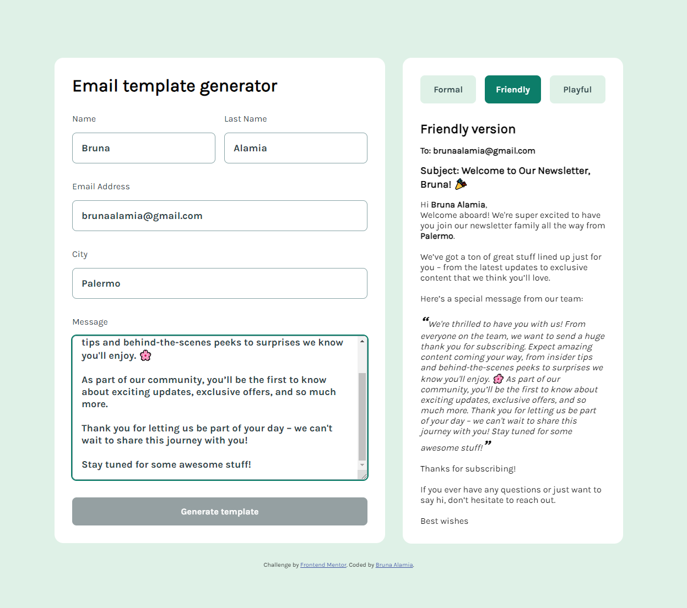

<!-- PROJECT -->

<a id="readme-top"></a>

<div align="center">
 

  <h3 align="center">React Template Form</h3>

  <p align="center">
    A personal project made starting from a Frontend Mentor exercise during the Frontend - Coding Bootcamp at Edgemony.
  </p>
</div>

<!-- TABLE OF CONTENTS -->
<details>
  <summary>Table of Contents</summary>
  <ol>
    <li>
      <a href="#about-the-project">About The Project</a>
      <ul>
        <li>
            <a href="#built-with">Built With</a>
        </li>
        <li>
            <a href="#components">Components</a>
        </li>
        <li>
            <a href="#functionality">Functionality</a>
        </li>
        <li>
            <a href="#state-management">State Management</a>
        </li>
        <li>
            <a href="#context">Context</a>
        </li>
        <li>
            <a href="#deployment">Deployment</a>
        </li>
      </ul>
    </li>
    <li>
        <a href="#getting-started">Getting Started</a>
    </li>
    <li>
        <a href="#contacts">Contacts</a>
    </li>
    <li>
        <a href="#license">License</a>
    </li>
    <li>
        <a href="#credits">Credits</a>
    </li>
  </ol>
</details>

<!-- ABOUT THE PROJECT -->

## About The Project

This project is a React-based application that helps write a welcome email using a form with a customizable template feature. The application allows users to input their information, select a template style, and view a preview of the email.

### Built With

<div display= "flex">
  
    
    

</div>

### Components

- `[App]`: the main entry point of the application. It renders a main element containing a `[Form]` component and a `[Template]` component. The `[App]` component manages the state of the template visibility and user information.
- `[Form]`: is responsible for collecting user information, including first name, last name, email, city, and message. It also handles the submission of the form and updates the `templateVisibility` state.
- `[Template]`: is a container for three different template styles: Formal, Friendly, and Playful. It allows users to switch between these styles using buttons. The selected template is rendered based on the `templateStyle` state.
- `[Template Styles]`: There are three template styles: Formal, Friendly, and Playful. Each style is a separate component that renders a different layout and design for the newsletter.

<p align="right">(<a href="#readme-top">back to top</a>)</p>

### Functionality

- `User Input`: The user fills out the form with their information.
- `Template Selection`: The user selects a template style using the buttons.
- `Template Rendering`: The selected template is rendered with the user's information.
- `Template Switching`: The user can switch between template styles using the buttons.

<p align="right">(<a href="#readme-top">back to top</a>)</p>

### State Management

The application uses React's useState hook to manage the following states:

- `templateVisibility`: A boolean indicating whether the template is visible.
- `userInfo`: An object containing the user's information (first name, last name, email, city, and message).
- `templateStyle`: A string indicating the selected template style (Formal, Friendly, or Playful).

<p align="right">(<a href="#readme-top">back to top</a>)</p>

### Context

The application uses React's Context API to share the `userInfo` state between the `[Form]` and `[Template]` components.

<p align="right">(<a href="#readme-top">back to top</a>)</p>

### Deployment

The application is deployed using Vite, a modern web development server. The `index.html` file serves as the entry point, and the `main.jsx` file is the main application file.

<p align="right">(<a href="#readme-top">back to top</a>)</p>

<!-- GETTING STARTED -->

## Getting Started

To get a local copy up and running follow these steps.

### Prerequisites

- Node.js (version 14 or higher)
- npm (version 6 or higher)
- A code editor or IDE of your choice

1. Clone the project repository using the following command:

   ```sh
   git clone https://github.com/majinbrum/react-template-form.git
   ```

2. Navigate to the project directory and install the dependencies using npm:
   ```sh
   cd react-template-form
    npm install
   ```
3. Start the development server using Vite:
   ```sh
   npm run dev
   ```
4. Now you can open the application in your web browser by navigating to `http://localhost:3000`.

<p align="right">(<a href="#readme-top">back to top</a>)</p>

<!-- CONTACTS -->

## Contacts

**Bruna Alamia** **-** [@linkedin](https://linkedin.com/in/brunaalamia) **-** brunaalamia@gmail.com

<p align="right">(<a href="#readme-top">back to top</a>)</p>

<!-- LICENSE -->

## License

This project is licensed under the MIT License.

<p>Copyright (c) 2024 Bruna Alamia

Permission is hereby granted, free of charge, to any person
obtaining a copy of this software and associated documentation
files (the "Software"), to deal in the Software without
restriction, including without limitation the rights to use,
copy, modify, merge, publish, distribute, sublicense, and/or sell
copies of the Software, and to permit persons to whom the
Software is furnished to do so, subject to the following
conditions:

The above copyright notice and this permission notice shall be
included in all copies or substantial portions of the Software.

THE SOFTWARE IS PROVIDED "AS IS", WITHOUT WARRANTY OF ANY KIND,
EXPRESS OR IMPLIED, INCLUDING BUT NOT LIMITED TO THE WARRANTIES
OF MERCHANTABILITY, FITNESS FOR A PARTICULAR PURPOSE AND
NONINFRINGEMENT. IN NO EVENT SHALL THE AUTHORS OR COPYRIGHT
HOLDERS BE LIABLE FOR ANY CLAIM, DAMAGES OR OTHER LIABILITY,
WHETHER IN AN ACTION OF CONTRACT, TORT OR OTHERWISE, ARISING
FROM, OUT OF OR IN CONNECTION WITH THE SOFTWARE OR THE USE OR
OTHER DEALINGS IN THE SOFTWARE.</p>

<!-- CREDITS -->

## Credits

- [Frontend Mentor](https://www.frontendmentor.io/)
